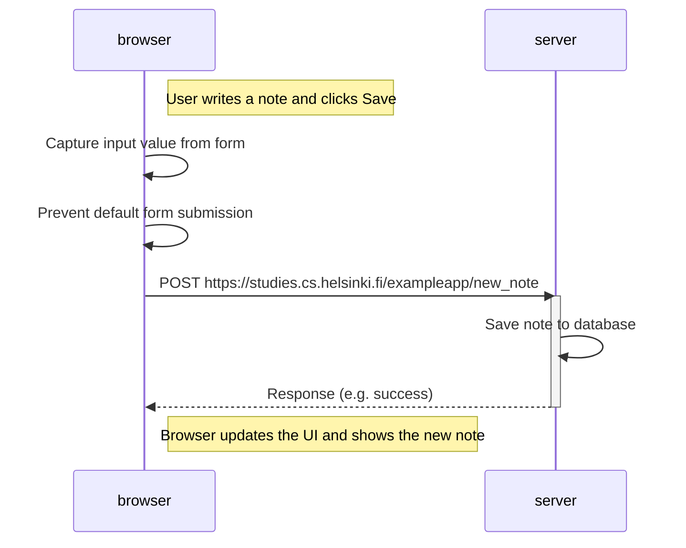

```mermaid
sequenceDiagram
    participant browser
    participant server

    Note right of browser: User writes a note and clicks Save

    browser->>browser: Capture input value from form
    browser->>browser: Prevent default form submission

    browser->>server: POST https://studies.cs.helsinki.fi/exampleapp/new_note
    activate server
    server->>server: Save note to database
    server-->>browser: Response (e.g. success)

    deactivate server

    Note right of browser: Browser updates the UI and shows the new note
```