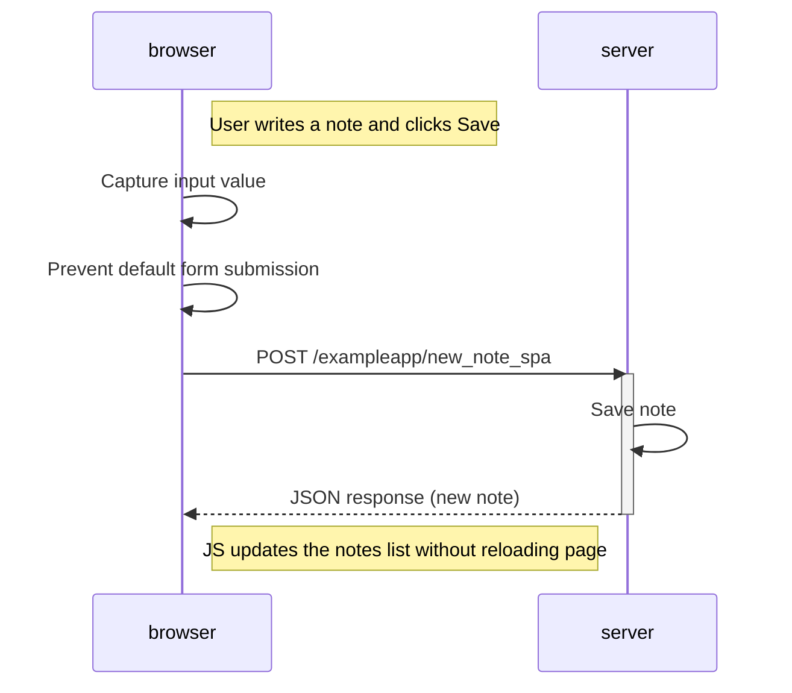

## New Note in SPA Diagram

```mermaid
sequenceDiagram
    participant browser
    participant server

    Note right of browser: User writes a note and clicks Save

    browser->>browser: Capture input value
    browser->>browser: Prevent default form submission

    browser->>server: POST /exampleapp/new_note_spa
    activate server
    server->>server: Save note
    server-->>browser: JSON response (new note)
    deactivate server

    Note right of browser: JS updates the notes list without reloading page
```