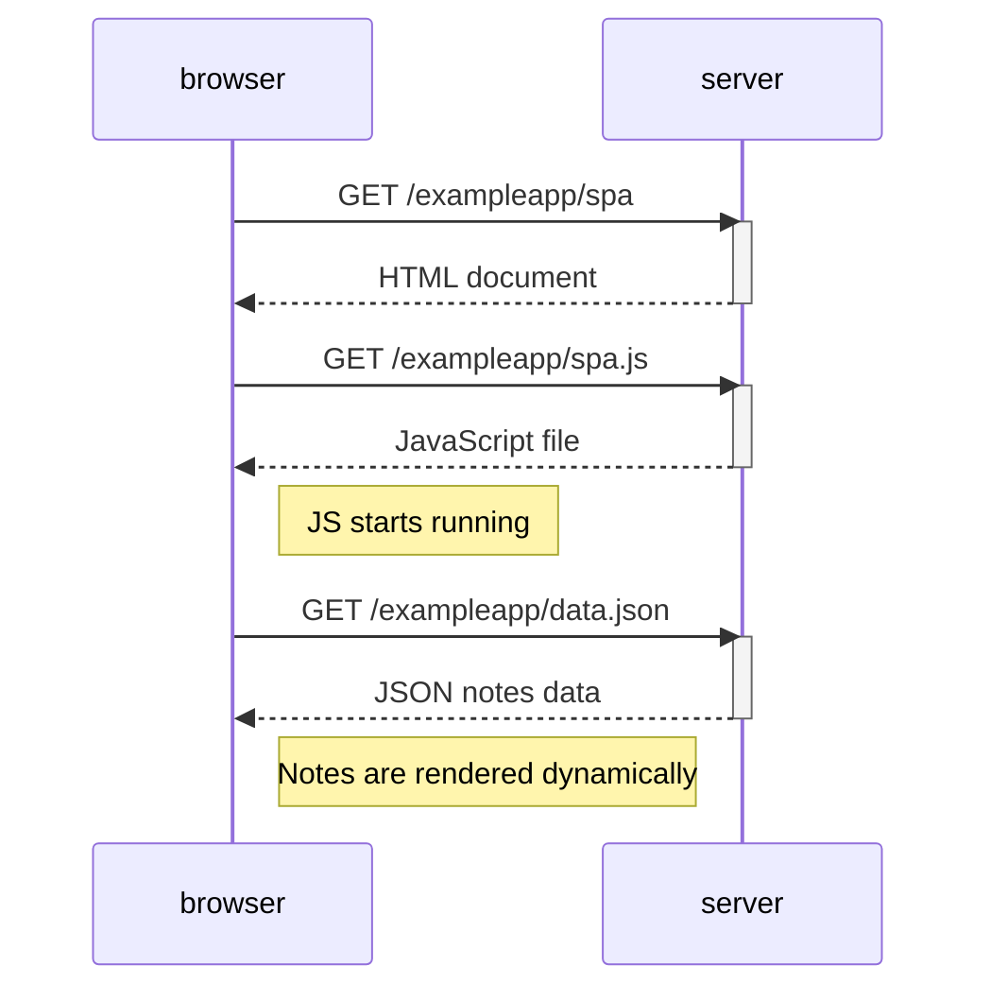

## SPA Page Load Diagram

```mermaid
sequenceDiagram
    participant browser
    participant server

    browser->>server: GET /exampleapp/spa
    activate server
    server-->>browser: HTML document
    deactivate server

    browser->>server: GET /exampleapp/spa.js
    activate server
    server-->>browser: JavaScript file
    deactivate server

    Note right of browser: JS starts running

    browser->>server: GET /exampleapp/data.json
    activate server
    server-->>browser: JSON notes data
    deactivate server

    Note right of browser: Notes are rendered dynamically
```